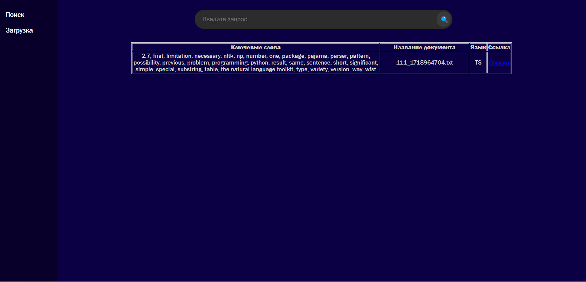

## Клиент для каталогизации текстовых документов по ключевым словам
### Основа - FastAPI, spaCy, MongoDB

#### Установка:
* Установить MongoDBCompass
* Скачать исходный код:
    ```commandline
    user/> git clone https://github.com/reirose/diplom-wrapper
    user/> cd diplom-wrapper
    ```

* Изменить ссылку для подключения к БД в файле `bin/db_init.py`:
    ```
    client = MongoClient("mongodb://connection_string:port")
    db = client.get_database("database_name")
    kw_db = db.get_collection("keywords_database")
   ```

* Запустить клиент и перейти на `localhost:27015`:
    ```commandline
    python main.py
```

